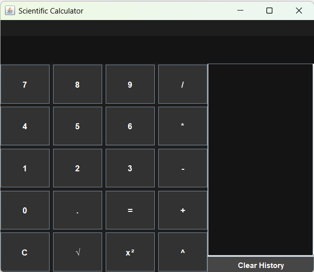

# 🧮 Scientific Calculator (Java)

A modern **scientific calculator desktop app** built using Java Swing with a clean dark UI and advanced mathematical operations.

---

## 🚀 Features

* Basic operations (+, −, ×, ÷)
* Scientific functions (√, x², power)
* Dark UI 🌙
* Keyboard support ⌨️
* Expression display
* History panel with clear option
* Error handling

---

## 💻 Download & Run

👉 Download the EXE from the repository (or release section) and double-click to run.

---

## 📸 Preview



---

## 🛠️ Tech Stack

* Java (Swing)
* OOP Concepts
* Event Handling

---

## 📚 Key Learnings

* Built GUI applications using Java Swing
* Implemented event-driven programming
* Managed state handling for calculator operations
* Packaged Java app into executable (.exe)

---

## ▶️ How to Run

### Run EXE

Double-click `ScientificCalculator.exe`

### Run JAR

```
java -jar ScientificCalculator.jar
```

---

## 👨‍💻 Author

Subham Kumar
📧 [shubhamkumar13082004@gmail.com](mailto:shubhamkumar13082004@gmail.com)
🔗 LinkedIn: [www.linkedin.com/in/subhamkumar08](http://www.linkedin.com/in/subhamkumar08)


## ⭐ If you like this project

Give it a ⭐ on GitHub!
